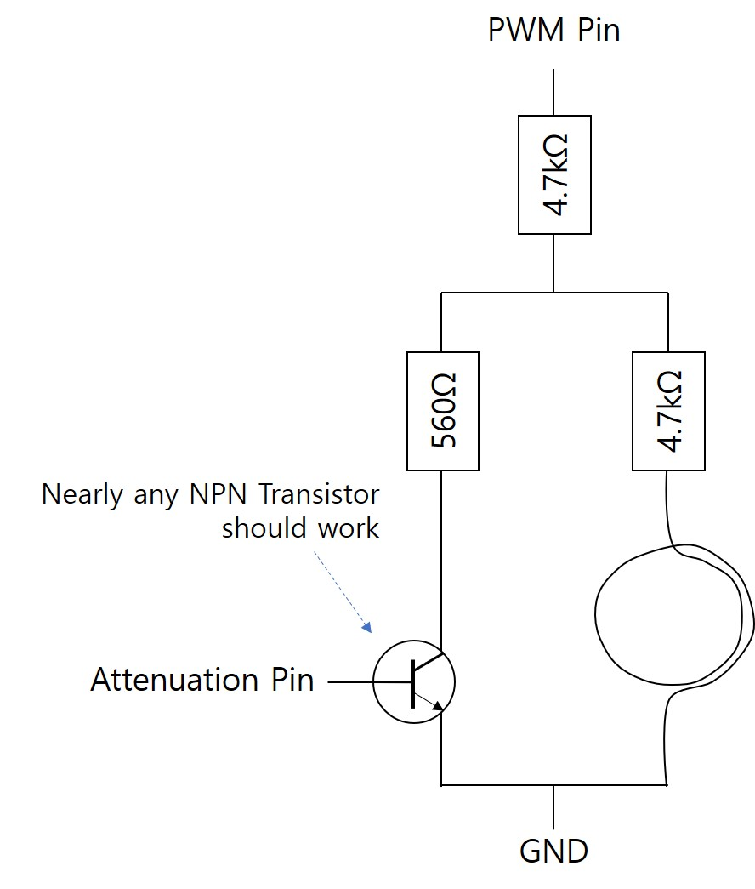
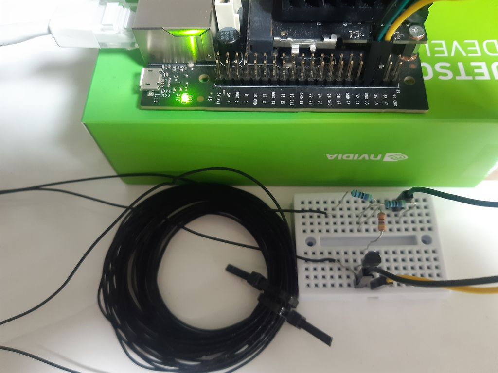

# txtempus — radio time-station transmitter & Raspberry Pi appliance

Bring a radio-controlled clock or watch back to life where it can't hear its
time station. **txtempus** takes the (NTP-disciplined) system clock of a
Raspberry Pi and generates a low-frequency, amplitude-modulated carrier on a
GPIO pin. Magnetically coupled through a small wire loop held a few centimetres
away, that signal sets [DCF77], [WWVB], [MSF], [JJY] and [BPC] clocks/watches.

This fork packages the original command-line transmitter into a small,
config-driven **appliance** for a Raspberry Pi Zero W on a home LAN:

- a single config file (`/etc/txtempus.conf`),
- a `systemd` scheduler that broadcasts for a few minutes at night,
- a tiny **web UI** to pick the station/region, transmit on demand, edit the
  schedule, see what time/DST is being sent, and read a per-model **watch guide**,
- an installer/uninstaller, encoder **tests**, and **CI** that cross-compiles for ARM.

> ⚠️ **Before you transmit, make sure you follow your local laws on radio
> transmissions.** The coupling here is intentionally very weak (a few cm range)
> to set a nearby watch without causing interference — but the responsibility is
> yours.

This is a fork of Henner Zeller's [hzeller/txtempus]; all credit for the core
transmitter and protocol work is his (see [Credits](#credits)).

---

## Contents
- [Supported time services](#supported-time-services)
- [How it works](#how-it-works)
- [Hardware](#hardware)
- [Build](#build)
- [Run (command line)](#run-command-line)
- [Appliance: config, scheduler & install](#appliance-config-scheduler--install)
- [Web interface](#web-interface)
- [Watch guide (modular)](#watch-guide-modular)
- [Tests](#tests)
- [Continuous integration](#continuous-integration)
- [Project documentation](#project-documentation)
- [Limitations & platform notes](#limitations--platform-notes)
- [Credits](#credits)

---

## Supported time services

| Service | Region | Carrier | CLI | Notes |
|---|---|---|---|---|
| **DCF77** | Germany / Europe | **77.5 kHz** | `-s DCF77` | Pi synthesises ~77500.003 Hz |
| **WWVB** | USA | **60 kHz** | `-s WWVB` | Transmitted in UTC |
| **MSF** | United Kingdom | **60 kHz** | `-s MSF` | On-off keyed (no attenuation pin needed) |
| **JJY** | Japan | **40 / 60 kHz** | `-s JJY40` / `-s JJY60` | Two transmitters exist |
| **BPC** ⚠️ | China | **68.5 kHz** | `-s BPC` | **Experimental** — see below |

Each is a self-contained `TimeSignalSource` subclass (carrier frequency + a
per-second amplitude-modulation pattern), so adding a station doesn't touch the
others.

**BPC is experimental.** It uses *quaternary* pulse-width modulation (each
second the carrier is reduced for 100/200/300/400 ms to encode a 2-bit symbol;
a 20-second frame is sent three times per minute). The carrier and modulation
mechanism are implemented and visible with `-n`, but BPC's exact field/bit
layout is reverse-engineered — the mapping in `src/bpc-source.cc` is a tentative
best-effort that has not been verified against a real receiver. If you have a
BPC-capable clock (e.g. a Citizen Skyhawk set to a Chinese city, or a Casio
Multi-Band 6), please test and report.

## How it works

Each station broadcasts the time as one (or two) bits per second by briefly
**reducing the carrier amplitude** (or, for MSF, switching it off). Over a
minute the bits carry the full date/time as BCD with parity; the receiver waits
for the minute marker, then decodes. Most stations transmit the data for the
*upcoming* minute and switch over on the minute boundary.

txtempus reproduces this by synthesising the carrier on the Pi's general-purpose
clock output and toggling a second GPIO to attenuate it on schedule, aligned to
real second boundaries under a real-time scheduler. Keep the Pi's clock accurate
with `ntpd`/`chrony` (the included scheduler nudges NTP before each run).

## Hardware

### Raspberry Pi
Three resistors — 2×4.7 kΩ and 1×560 Ω (precision not critical) — wired to
**GPIO4** (carrier) and **GPIO17** (attenuation):

Schematic                      | Real world
-------------------------------|------------------------------
   |

GPIO4 and GPIO17 are on the inner row of the header, three pins in. Wire a loop
of wire (≈10–20 turns) between the open end of one 4.7 kΩ and ground — this is
the coupling coil. Bring it within a few centimetres of the watch/clock antenna.


Being *too* close can confuse a sensitive receiver, so experiment with distance;
if it won't receive, add more turns to the coil. For **MSF** you don't need
GPIO17 or the 560 Ω resistor (it's on-off keyed) — a single 10 kΩ in place of the
two 4.7 kΩ works. BPC uses the same wiring as DCF77.

### Nvidia Jetson (experimental)
Use one PWM pin (carrier) and one attenuation pin, plus an NPN transistor and the
same resistors. Pins vary by model:

|Devices|PWM pin (board #)|Attenuation pin (board #)|
|-------|-------------------------|---------------------------------|
|Jetson TX1 / TX2|Not supported|Not supported|
|Jetson Xavier, Clara AGX Xavier, Jetson Orin|18|16|
|Other devices|33|35|

Schematic                       | Real world (Jetson Nano)
--------------------------------|------------------------------
   |

## Build

```sh
sudo apt-get install git build-essential cmake -y
git clone https://github.com/tunlezah/dcf77.git
cd dcf77
mkdir build && cd build
```

**Raspberry Pi:**
```sh
cmake ../          # or: cmake ../ -DPLATFORM=rpi
make
sudo make install  # installs /usr/bin/txtempus
```

**Nvidia Jetson** (install [JetsonGPIO] first, and configure the pinmux):
```sh
cmake ../ -DPLATFORM=jetson
make
```

## Run (command line)

```sh
sudo ./txtempus -v -s DCF77        # transmit current time as DCF77 (needs root)
./txtempus -n -s WWVB              # dry-run: print the modulation envelope (no root, any machine)
sudo ./txtempus -s DCF77 -r 10     # run for 10 minutes, then stop
```

```
usage: ./txtempus [options]
Options:
        -s <service>          : Service; one of 'DCF77', 'WWVB', 'JJY40', 'JJY60', 'MSF', 'BPC'
        -r <minutes>          : Run for a limited number of minutes. (default: no limit)
        -t 'YYYY-MM-DD HH:MM' : Transmit the given local time (default: now)
        -z <minutes>          : Offset the transmitted time from local (default: 0)
        -v                    : Verbose.
        -n                    : Dry-run: only show the modulation envelope.
        -f                    : Force run on unsupported hardware (e.g. Pi 4); carrier may be wrong.
        -h                    : This help.
```

The dry-run (`-n`) renders each second of the minute as ASCII — `_` is low
(reduced) carrier, `#` is high — which is great for understanding a protocol and
is what the tests use:

```
$ ./txtempus -n -s wwvb
2018-08-17 13:22:00 -> tx-modulation
:00 [________##]
:01 [__########]
:02 [_____#####]
  ... and so on for the whole minute ...
```

## Appliance: config, scheduler & install

For a set-and-forget device, install the appliance layer:

```sh
sudo make install            # the binary, if you haven't already
sudo ./deploy/install.sh
```

`install.sh` is **idempotent / upgrade-safe**: it stops a running install,
installs the files below, migrates an existing schedule, and warns about leftover
txtempus **cron** entries (`--purge-cron` removes them). It installs:

- **`/etc/txtempus.conf`** — the single source of truth (station, run duration,
  zone offset, nightly schedule, web bind/port/PIN), shell-sourceable `KEY=VALUE`,
  read by both the scheduler and the web UI.
- **systemd units** — `txtempus-scheduler.{service,timer}` (nightly runs at the
  times in `SCHEDULE_TIMES`), `txtempus-oneshot.service` (on-demand transmit),
  and `txtempus-web.service` (the web UI).
- **`txtempus-scheduler.sh`** — the nightly runner: nudges NTP, monitors CPU
  temperature, runs the binary for `RUN_DURATION`, records the last result.
- **`txtempus-control.sh`** — the small privileged shim the web UI drives.

Typical setup: a Pi Zero W keeps its clock disciplined with `ntpd`/`chrony`, and
the timer transmits for ~10 minutes a few times a night (default 01:59 / 02:59 /
03:59) — right before a watch does its nightly receive.

```sh
systemctl list-timers txtempus-scheduler.timer    # when will it run?
journalctl -u txtempus-scheduler.service -f        # what happened?
sudo ./deploy/uninstall.sh                          # remove (add --purge to drop config too)
```

Prefer plain cron? A manual alternative:
```crontab
57 1,2  * * *  root  /usr/bin/txtempus -s DCF77 -r 10
```

## Web interface

A tiny, dependency-free **Python-stdlib** sidecar (`web/txtempus-web.py`) serves
one page plus a small JSON API on a trusted LAN. It is built for a Pi Zero W:
~0 % idle CPU, a few MB RAM, no extra packages, no build step. It **never
transmits itself** — it only writes the config and asks systemd to (re)start the
binary, staying out of the real-time transmit window.

After `install.sh`, open **`http://<your-pi>:8080/`** to:

- **pick the station / region** (DCF77 / WWVB / MSF / JJY40 / JJY60 / BPC),
- **transmit now / stop** for a chosen duration,
- **edit the nightly schedule** — and see the saved times and the next run, so
  you know exactly when it will broadcast,
- see **what time the watch will be set to** (local for DCF77/MSF/JJY, UTC for
  WWVB, plus any zone offset) and the **DST signal** being sent (CET/CEST,
  GMT/BST; JJY/BPC have no DST),
- use the **watch-sync helper**: type what your watch currently shows and it
  tells you how far it has drifted (so you can tell whether its "2 AM" check is
  really 2 AM),
- read the **watch guide** for your model (see below),
- watch **live status**: transmitting?, system time, NTP sync, CPU temperature,
- **preview** a station's modulation (the `-n` chart), gated off while transmitting.

```
┌───────────────────────────────────────────────────────────────────────┐
│  txtempus · time-signal transmitter                       [● TX ACTIVE] │
├───────────────────────────────────────────────────────────────────────┤
│  STATUS    State: Transmitting (DCF77, 77.5 kHz)                         │
│            Will set watch to: Sun 2026-06-07 02:03 (local)              │
│            DST signal: CEST (central European summer time)               │
│            Next run: tomorrow 01:59 · NTP: ✔ · CPU 48.7 °C               │
├───────────────────────────────────────────────────────────────────────┤
│  STATION ( ) DCF77 — Germany/Europe 77.5 kHz   ( ) WWVB — USA 60 kHz ... │
│  TRANSMIT NOW  Duration [10] min  [▶ Start] [■ Stop]                     │
│  SCHEDULE  [x] enabled  Broadcast at [01:59,02:59,03:59]                 │
│  WATCH GUIDE  [ Citizen Skyhawk A-T (U680) ▾ ]                           │
└───────────────────────────────────────────────────────────────────────┘
```

**Security (LAN-only, deliberately light):** the UI is meant for a private
network. It runs as root by default for simplicity; set an optional `WEB_PIN` in
the config to gate changes. To harden, run it as a non-root user with a narrow
sudo grant to `txtempus-control.sh` — see the comments in
`deploy/systemd/txtempus-web.service`. Don't expose it to the open internet.

## Watch guide (modular)

The web UI's **watch guide** shows, for a chosen model, which stations it
receives (checked against your current broadcast), when it auto-syncs, and the
basic setup steps. It's **data-driven** — entries live in
`/etc/txtempus-watches.json` (seeded with the Citizen Skyhawk A-T (U680), Casio
Multi-Band 6, Junghans Mega, and a generic DCF77 clock). **Add your own watch by
editing that JSON — no code change required.**

## Tests

A golden-output test exercises every station's encoder through the `-n` dry-run
(no root, no Pi) and compares against committed expected envelopes, and a BPC
self-test round-trips the BPC envelope back to time fields:

```sh
cmake -S . -B build && cmake --build build
test/run-golden.sh            # PASS/FAIL per station
test/run-golden.sh --update   # regenerate expected output after an intentional change
python3 test/bpc_selftest.py  # BPC encoder round-trip (time, parity, frames, markers)
```

## Continuous integration

`.github/workflows/build.yml` runs on every push/PR:

- **Build & test (host):** builds, runs the golden tests and the BPC self-test.
- **Cross-compile (32-bit ARM / Raspberry Pi):** installs `arm-linux-gnueabihf`
  and builds, confirming the code compiles for the Pi's ARM target.

## Project documentation

Deeper write-ups live alongside the code:

- [`summary.md`](summary.md) — architecture and what the project does.
- [`todo.md`](todo.md) — review: what works, what's flawed, prioritised fixes.
- [`future.md`](future.md) — prior art and a roadmap of possible additions.
- [`web.md`](web.md) — the full design behind the web interface.

## Limitations & platform notes

- **Run headless on the Pi.** The internal oscillator that can be used for the
  carrier is shared with HDMI; connecting a monitor changes it and the
  transmission fails.
- **Raspberry Pi 4 (BCM2711) is not supported** — frequency generation doesn't
  work there, so txtempus now refuses to run on a Pi 4 unless you pass `-f`. Use
  an older Pi (the Pi Zero W is the recommended target). Pull requests welcome.
- These protocols also carry bits for DST-change *announcements*, leap seconds
  and (on some stations) phase modulation, which are not generated. Consumer
  clocks are generally fine without them — the current DST state *is* sent.

<hr/>

**tx** _common telecommunication abbreviation for 'transmit'_<br/>
**tempus**, n _Latin. Time; period; age_

## Credits

- Original project and all core transmitter/protocol work:
  **Henner Zeller** — [hzeller/txtempus]. Jetson port by Jueon Park.
- Licensed under the **GNU General Public License** (see [`COPYING`](COPYING)).
- This repository ([tunlezah/dcf77](https://github.com/tunlezah/dcf77)) adds the
  appliance layer (config, systemd, installer), the web UI, the BPC station, the
  watch guide, tests and CI.

[DCF77]: https://en.wikipedia.org/wiki/DCF77
[WWVB]: https://en.wikipedia.org/wiki/WWVB
[MSF]: https://en.wikipedia.org/wiki/Time_from_NPL_(MSF)
[JJY]: https://en.wikipedia.org/wiki/JJY
[BPC]: https://en.wikipedia.org/wiki/BPC_(time_signal)
[NTP]: https://en.wikipedia.org/wiki/Network_Time_Protocol
[JetsonGPIO]: https://github.com/pjueon/JetsonGPIO
[hzeller/txtempus]: https://github.com/hzeller/txtempus
